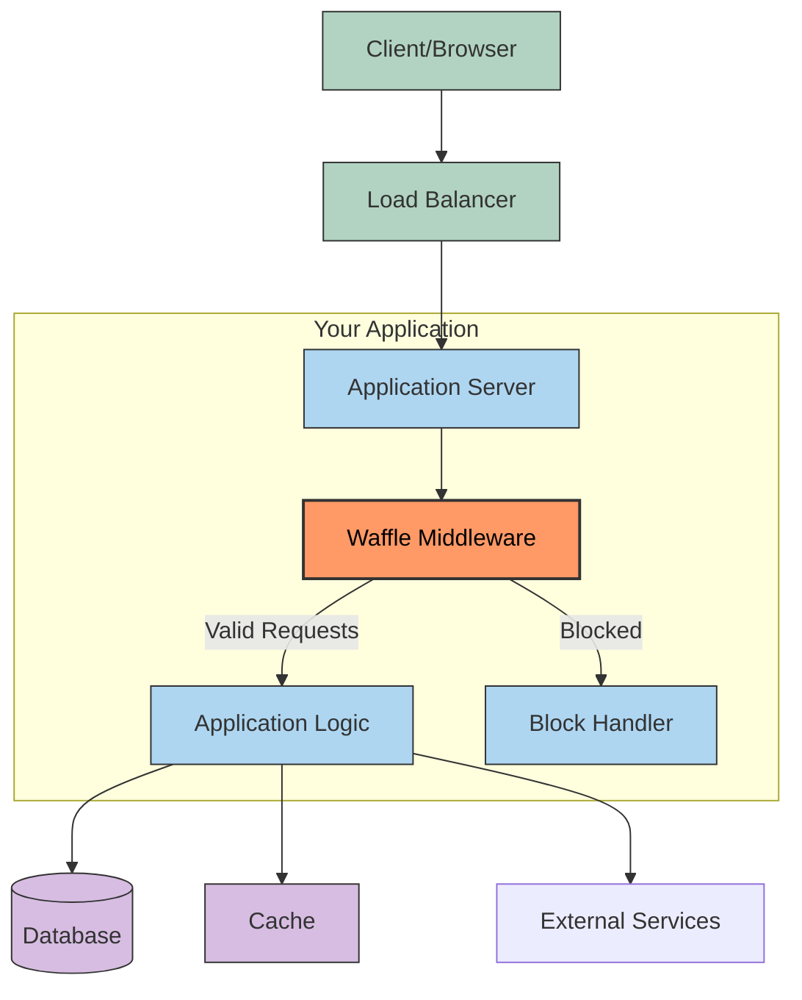
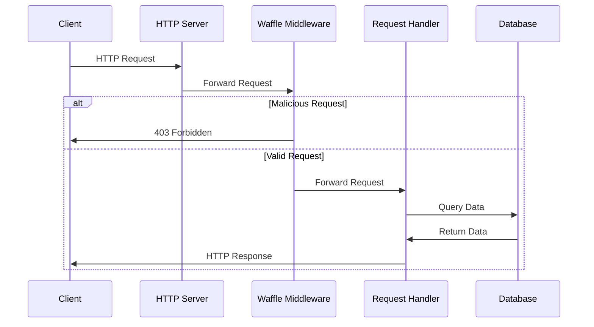
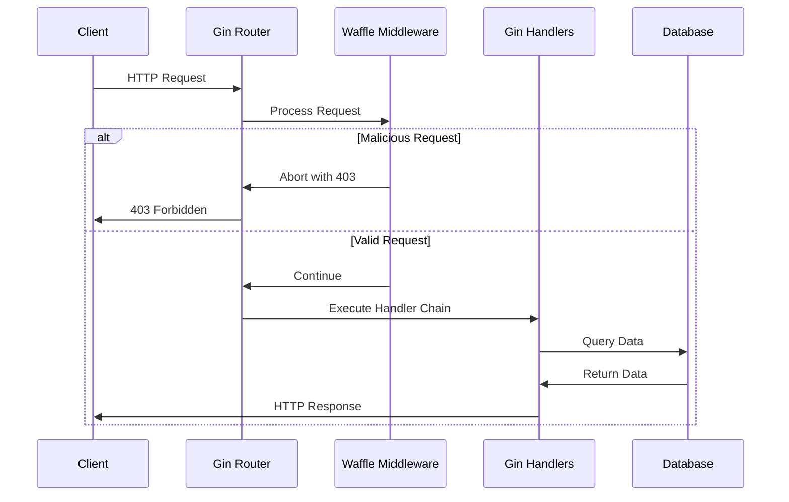
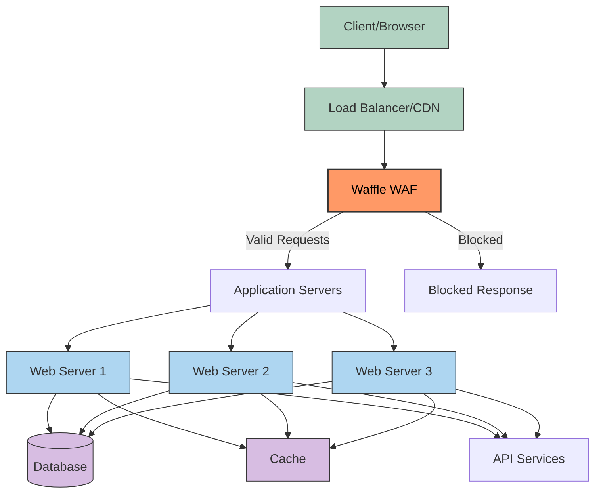
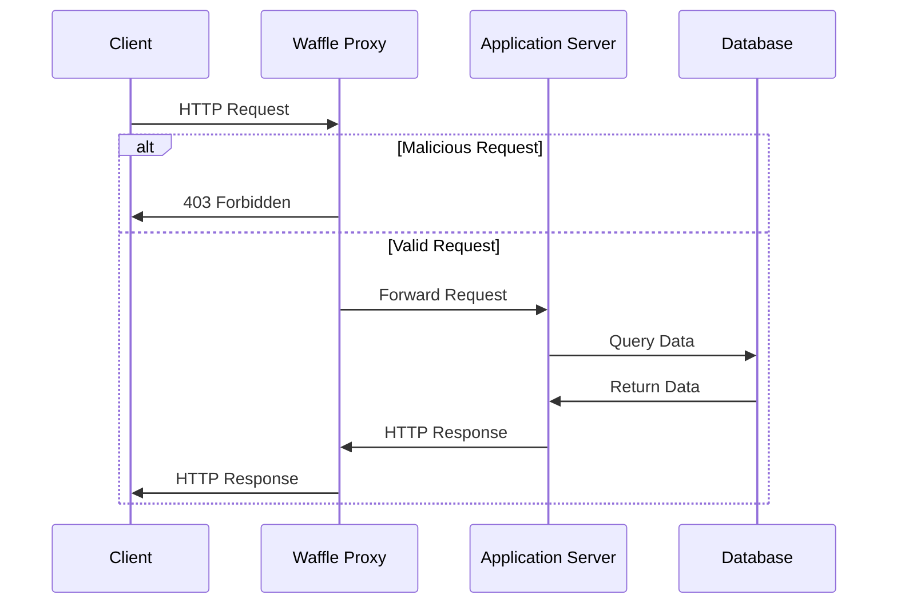
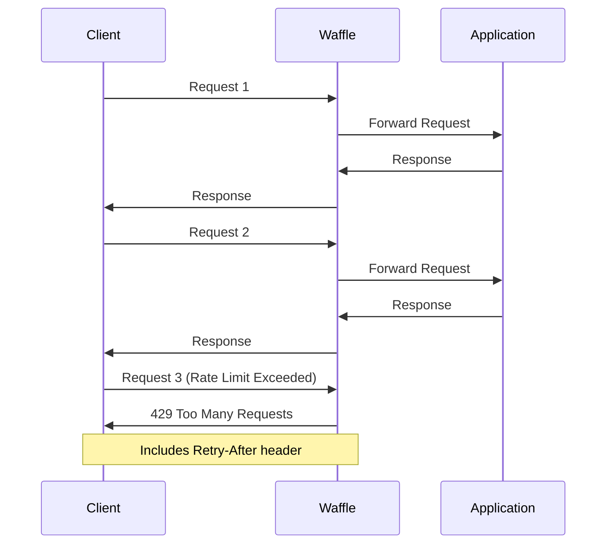
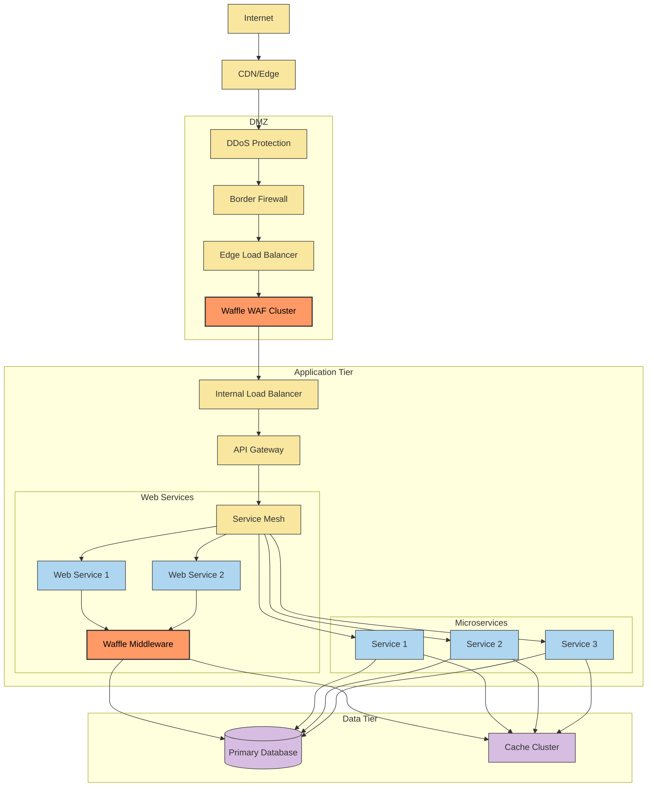
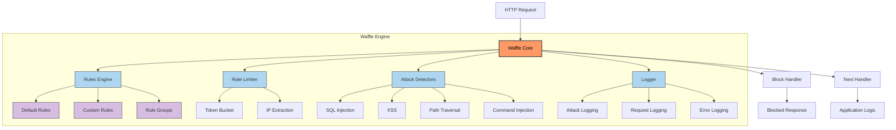
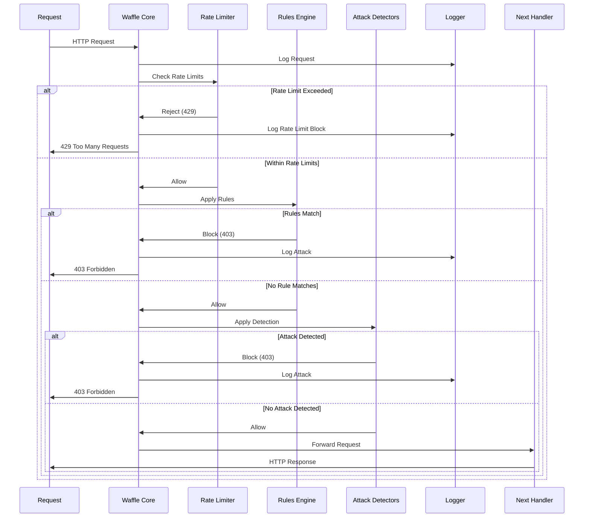

# Waffle System Architecture

This document illustrates how Waffle integrates into various application architectures to provide Web Application Firewall (WAF) protection.

## Architecture Overview

Waffle can be integrated into your application stack in two primary ways:
1. As a middleware component within your application
2. As a standalone reverse proxy in front of your application

The diagrams below illustrate both approaches.

## Middleware Integration

In this configuration, Waffle operates as middleware within your application, inspecting and filtering requests before they reach your application logic.

### Middleware Integration Examples

#### Standard Go HTTP Server

#### Gin Framework Integration

## Standalone Proxy Mode

In this standalone configuration, Waffle operates as a reverse proxy in front of your application servers, filtering all incoming requests before they reach your application.

### Standalone Proxy Example

## Rate Limiting Behavior

## Enterprise Deployment Example

For a more complex enterprise deployment, Waffle can be deployed at multiple layers:

## Waffle Internal Architecture

Waffle's internal architecture is designed to be modular, efficient, and flexible. The following diagram illustrates the components that make up the Waffle WAF:

### Component Flow

The request processing flow in Waffle proceeds as follows:

### Key Components

1. **Core Engine**: Orchestrates the request processing pipeline and integrates all components.

2. **Rules Engine**: 
   - Evaluates HTTP requests against configurable rules
   - Supports regex patterns, IP-based rules, and custom rule implementations
   - Organizes rules into logical groups for better management

3. **Rate Limiter**:
   - Implements token bucket algorithm for rate limiting
   - Supports per-IP rate limiting
   - Configurable rate and burst parameters

4. **Attack Detectors**:
   - Specialized modules for detecting specific attack vectors
   - SQL Injection detection
   - XSS detection
   - Path traversal detection
   - Command injection detection

5. **Logger**:
   - Detailed logging of attacks and suspicious activity
   - Request logging for audit trails
   - Error logging for troubleshooting

6. **Middleware Adapters**:
   - Standard HTTP middleware
   - Gin framework adapter
   - Echo framework adapter

7. **Proxy Mode**:
   - Standalone reverse proxy functionality
   - Configuration via YAML/JSON 